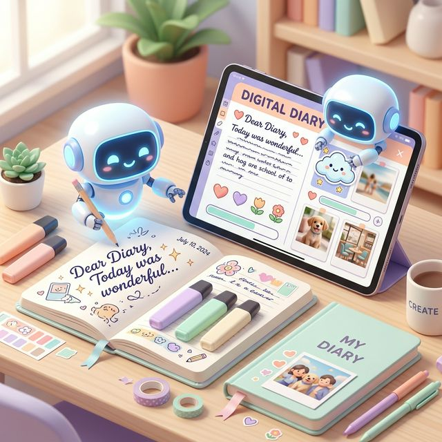
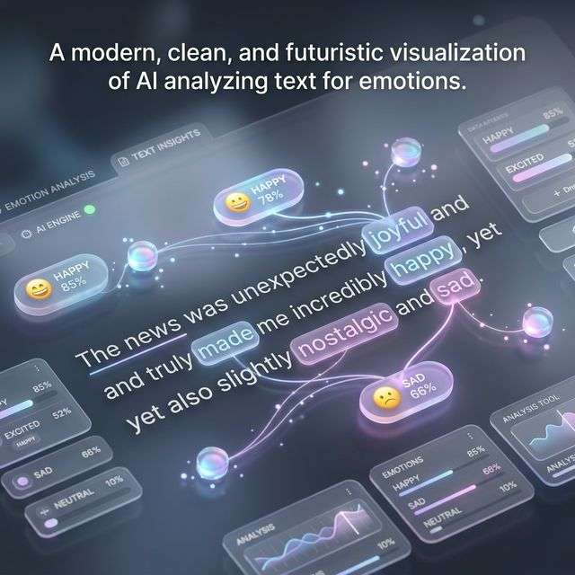
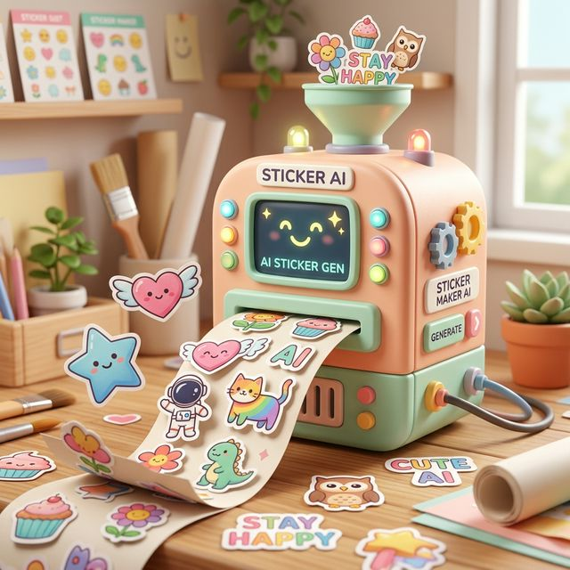

# 🎨 다꾸메이커 (Dakkumeikeo)

<p align="center">
  
</p>

<p align="center">
  
  
  
  
</p>

> **AI 연동 다이어리 꾸미기 보조 서비스**  
> 사용자의 아날로그 감성을 디지털 환경으로 옮겨주는 가장 똑똑한 방법. 손글씨를 분석하고 내용에 어울리는 맞춤형 스티커를 생성하여 나만의 다이어리를 완성합니다.

---

## 📌 주요 기능 (Key Features)

### 🔍 스마트 OCR & 텍스트 분석


- **고정밀 텍스트 추출**: Tesseract 연동 엔진을 통해 손글씨 이미지에서 텍스트를 고정밀도로 추출합니다.
- **감정 및 키워드 분석**: 추출된 텍스트에서 사용자의 감정(기쁨, 슬픔, 평온 등)을 분석하고 핵심 키워드를 도출합니다.
- **이미지 전처리**: 이미지 노이즈 제거 및 명암 조절 알고리즘으로 OCR 정확도를 극대화합니다.

<br clear="right"/>

### ✨ AI 맞춤형 스티커 생성


- **개인화된 디자인**: 분석된 감정과 키워드를 바탕으로 Stable Diffusion 기반 AI가 세계 디자인 트렌드에 맞는 스티커를 실시간 생성합니다.
- **스타일 커스터마이징**: 귀여운, 감성적인, 모던한 등 사용자가 원하는 스타일로 스티커를 변형할 수 있습니다.
- **스마트 배치 가이드**: 생성된 스티커와 텍스트를 조화롭게 배치할 수 있는 자동 레이아웃 기능(UI 배치 설계)을 제공합니다.

<br clear="left"/>

---

## 👥 팀 구성 (Team Members)

| 이름 | 역할 | 담당 업무 |
| :---: | :---: | :--- |
| **시세민** | BE | OCR 기술 조사, 엔진 선정 및 이미지 전거리 구현 |
| **전은수** | BE | 텍스트 감정 분석 알고리즘 설계 및 구현 |
| **장나정** | FE | 피그마 UI 디자인 및 전체 화면 구조 설계 |
| **손영주** | FE | 업로드/분석결과/메인 화면(캘린더) UI 개발 |
| **임민하** | FE | 스티커 미리보기/보관함 화면 구현 및 배치 기능 개발 |

---

## 🗺 프로젝트 로드맵 (Roadmap)

- **Phase 1: 기반 구축 (3/17 ~ 3/31)**
  - [x] 요구사항 분석 및 WBS 수립
  - [x] UI/UX 피그마 디자인 완료
  - [x] 개발 환경 및 인프라 셋팅
- **Phase 2: 핵심 엔진 개발 (4/1 ~ 4/30)**
  - [/] OCR 텍스트 추출 및 이미지 전처리 로직 구현
  - [/] 감정 분석 알고리즘 및 데이터 구축
  - [ ] AI 스티커 생성 엔진 연동
- **Phase 3: 프론트엔드 연동 (5/1 ~ 5/15)**
  - [ ] 주요 화면 UI 구현 (메인, 업로드, 결과, 보관함)
  - [ ] API 연동 및 테스트
- **Phase 4: 마무리 및 배포 (5/15 ~ 5/31)**
  - [ ] 최종 버그 수정 및 최적화
  - [ ] 프로젝트 시연 및 최종 발표

---

## 🛠 기술 스택 (Tech Stack)

- **Frontend**: `React`, `TypeScript`, `Tailwind CSS`, `Figma`
- **Backend**: `FastAPI`, `PostgreSQL`, `SQLAlchemy`
- **AI Engine**: `Tesseract (OCR)`, `Stable Diffusion (Sticker Gen)`, `NLTK/PyTorch (Emotion Analysis)`
- **DevOps**: `AWS`, `Docker`, `GitHub Actions`

---

## ⚙️ Getting Started (시작하기)

### 1. 설치
```bash
git clone https://github.com/Jju-daggu/daggu-frontend.git
cd daggu-frontend
npm install
```

### 2. 실행
```bash
npm run dev
```

---

## 🤝 기여하기 (Contributing)

이 프로젝트에 기여하고 싶으시다면 [CONTRIBUTING.md](CONTRIBUTING.md) 파일을 참고해 주세요.

## 📜 라이선스 (License)
이 프로젝트는 **MIT License**를 따릅니다. 자세한 내용은 [LICENSE](LICENSE) 파일을 참고하세요.

---
© 2026 Jju-daggu Team. Built with ❤️ and Artificial Intelligence.